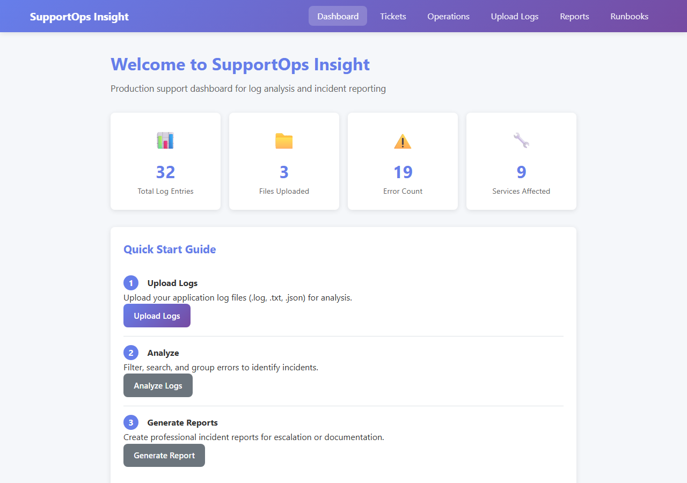
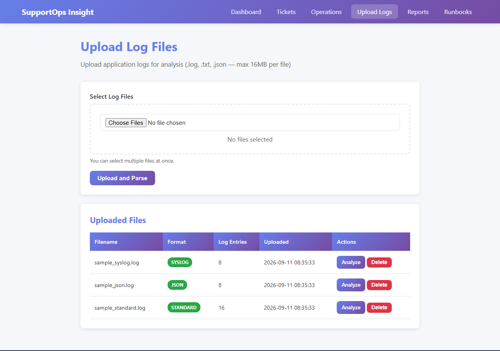
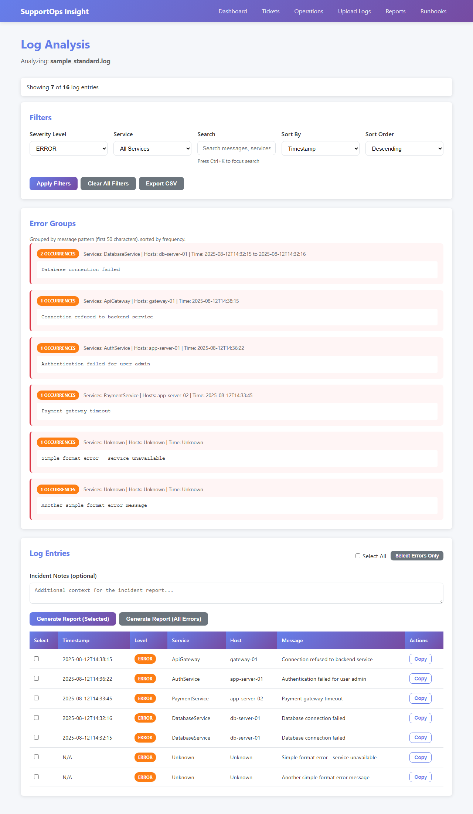
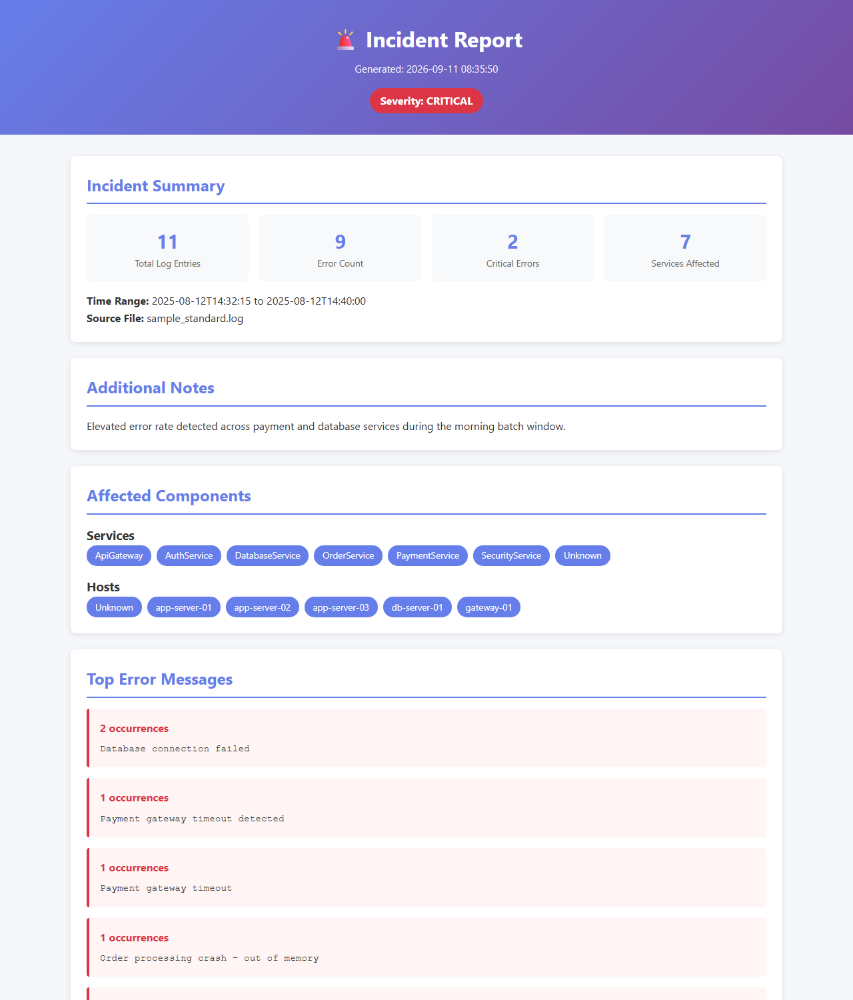
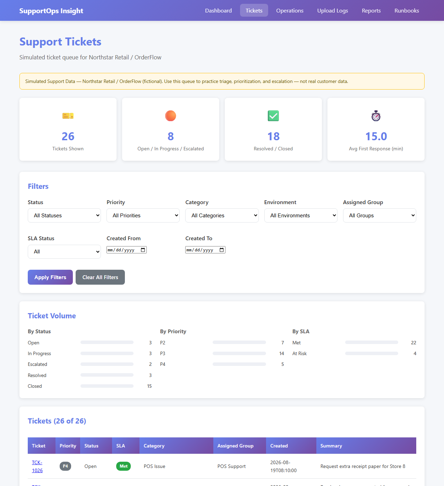
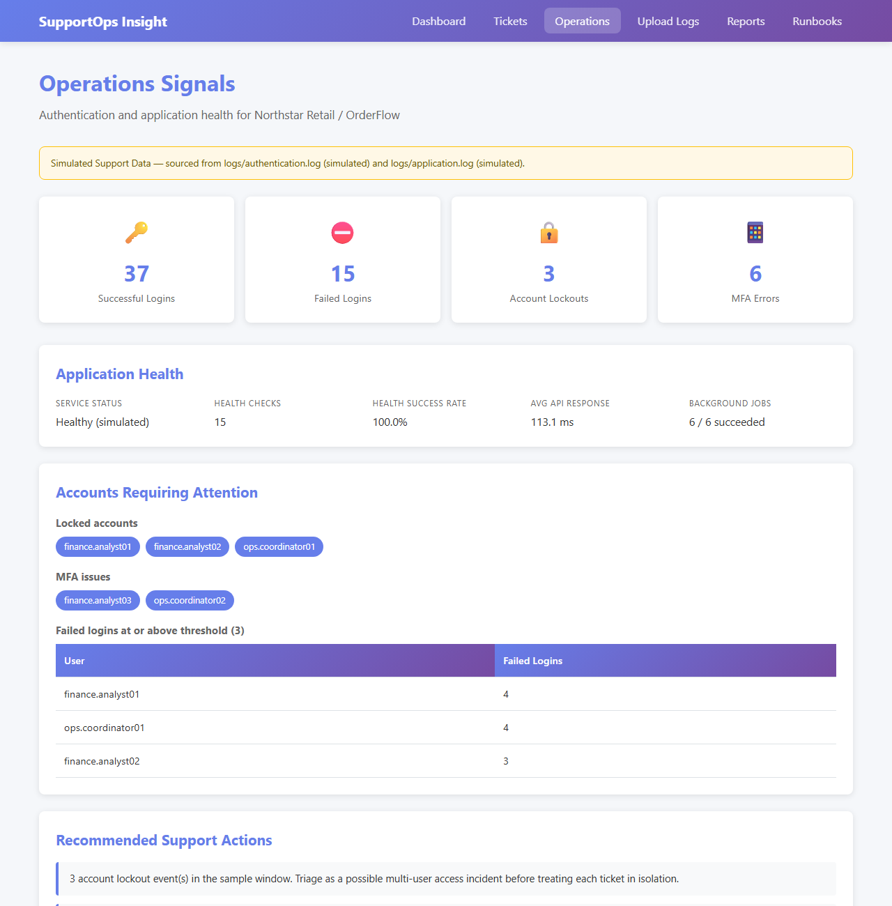

# SupportOps Insight

A production-support dashboard for IT/application support teams. Upload raw log files, get them parsed and classified automatically, and turn a pile of errors into an incident report in a few clicks.

Built with Python, Flask, and Jinja2 — no JS framework, no database. Log parsing, severity scoring, and report generation are all written from scratch, mostly because I wanted to understand how each piece works rather than pull in a library for it.

## Why I built this

Support teams do the same manual work over and over: pull raw logs, scan for errors, figure out if a few tickets are actually one incident, then write it all up for escalation. This app automates the repetitive part — parsing, grouping, severity scoring — so the actual triage decision is what's left for a human.

To make it feel like a real support tool instead of just a log parser, I added a simulated ticket queue, an auth/app-health signals dashboard, and a small runbook knowledge base, all tied to one fictional scenario (a retail company called "Northstar Retail" running a system called "OrderFlow"). It's clearly labeled as fictional in the UI — the data isn't meant to fool anyone, just to give the log parsing and incident reporting something realistic to work with.

## Screenshots

**Dashboard**


**Upload — multi-file upload with automatic format detection**


**Log analysis — filter, search, and group repeated errors**


**Incident report — print-ready HTML, generated in one click**


**Simulated ticket queue**


**Operations signals — auth events and app health**


## What it does

- Auto-detects and parses 4 log formats: standard `LEVEL [service] [host] message`, JSON, syslog, and plain `[ERROR] message`
- Filters logs by severity, service, and keyword; sorts by timestamp or severity
- Groups repeated errors by message pattern, with occurrence counts and affected services/hosts
- Scores severity based on log level plus keyword/service heuristics (things like `payment`, `auth`, `database` bump it up)
- Generates a self-contained, print-friendly HTML incident report from selected logs or "all errors"
- Simulated ticket queue with SLA tracking, triage checklists, and timelines
- Ops dashboard summarizing auth events (lockouts, MFA failures) and app health (uptime, API latency, job success)
- A small runbook knowledge base with cross-linked Markdown docs, rendered by a tiny Markdown-to-HTML converter I wrote instead of pulling in a package

## How it fits together

- `utils/log_parser.py` — tries JSON, then standard, then syslog, then plain-text regex against each line, normalizing whatever matches into one common shape
- `utils/severity_classifier.py` — scores each entry and groups related errors by the first 50 characters of the message
- `utils/incident_generator.py` — renders the HTML report with inline styles, so it's portable and prints cleanly
- `utils/ticket_store.py`, `utils/ops_signals.py`, `utils/markdown_lite.py` — power the ticket queue, the ops-signals dashboard, and the runbook viewer

## Running it locally

```bash
git clone https://github.com/darshanpushpan/SupportOps-Insight-dashboard.git
cd SupportOps-Insight-dashboard

python -m venv venv
venv\Scripts\activate        # Windows
source venv/bin/activate     # macOS/Linux

pip install -r requirements.txt
python app.py
```

Open [http://127.0.0.1:5000](http://127.0.0.1:5000). Sample logs (`sample_standard.log`, `sample_json.log`, `sample_syslog.log`) are in the repo root if you want to try the upload flow right away.

To regenerate the simulated ticket/ops data:

```bash
python scripts/generate_sample_tickets.py
python scripts/generate_sample_logs.py
python scripts/analyze_auth_logs.py
```

## Project structure

```
SupportOps-Insight-dashboard/
├── app.py                       # Flask app factory and routes
├── config.py                    # Dev/production config
├── requirements.txt
├── utils/
│   ├── log_parser.py            # Multi-format log parsing
│   ├── severity_classifier.py   # Error grouping and severity scoring
│   ├── incident_generator.py    # HTML incident report generation
│   ├── ticket_store.py          # Simulated ticket queue + metrics
│   ├── ops_signals.py           # Auth/app health signal aggregation
│   └── markdown_lite.py         # Dependency-free Markdown renderer
├── scripts/                     # Generators for the simulated data
├── templates/                   # Jinja2 templates
├── static/{css,js}/             # Styles and frontend interactivity
├── docs/                        # Runbooks + incident write-ups (Markdown)
├── data/                        # Simulated ticket data (JSON)
├── uploads/ / reports/ / logs/  # Runtime storage (auto-created)
└── sample_*.log                 # Sample files for each supported format
```

## API

```
GET /api/logs/<file_id>?level=ERROR&search=timeout&sort_by=timestamp&sort_order=desc
```

Returns JSON with the filtered logs and computed error groups for a given uploaded file.

## License

MIT
